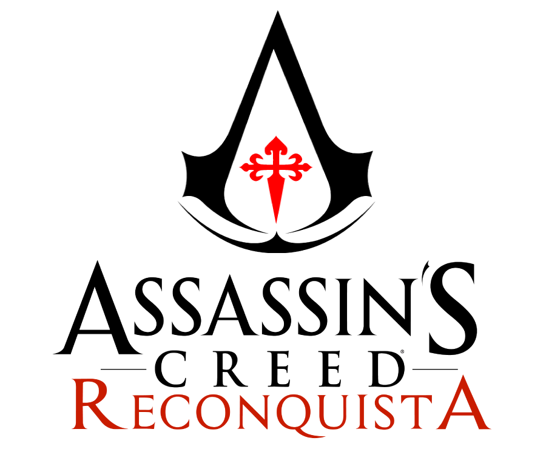

# 01 — Présentation

## Identité du projet

|                        |                                                     |
| ---------------------- | --------------------------------------------------- |
| **Titre**              | Assassin's Creed : Reconquista                      |
| **Nom de code**        | CRUX                                                |
| **Genre**              | Action-aventure, pré-recette light RPG              |
| **Références**         | The Ezio Collection, AC III, AC Unity               |
| **Période**            | XIIIe–XIVe siècle (1229–1307)                       |
| **Cadre géographique** | Pyrénées, sud de la France, Castille, Aragon, Paris |
| **Statut**             | Fan project — conception                            |

***

## Synopsis

L'histoire d'Assassin's Creed : Reconquista se déroule entre le XIIIe et le XIVe siècle, en pleine période du Moyen Âge, dans les Pyrénées. Elle met en scène un jeune homme, Léon Arsenault, fils d'Assassin, qui vit les horreurs de la guerre en devenant Templier, participant aux grands événements historiques comme la septième croisade orchestrée par le Roi Louis IX, dit Saint Louis, ou les théâtres de la Reconquista. Rongé par les mensonges des Templiers, Léon quitte l'Ordre du Temple et devient Assassin, se rachetant au fil d'une quête qui le conduit à devenir Maître Assassin de la Confrérie des Assassins français.

***

## Thématique centrale

**Vengeance / Rédemption**

Un homme qui cherche la rédemption pour des actes qu'il savait mauvais au moment même où il les commettait. La vengeance n'est qu'un déclencheur — ce qui reste après, c'est la question de savoir si on peut se racheter.

***

## Concept

Assassin's Creed : Reconquista s'inscrit dans la recette classique de la licence — linéarité assumée, gameplay centré infiltration/parkour, narration pilotée — sans les mécaniques de looter/leveling introduites après Origins.

Le jeu explore une période historique inédite dans la licence : la Reconquista ibérique et ses connexions avec la France capétienne, culminant avec la chute des Templiers en 1307 — événement directement lié au prologue d'AC Unity.

**Particularité narrative :** le protagoniste est Templier pendant la première moitié du jeu, Assassin pendant la seconde. Cette dualité se reflète dans le gameplay, les mécaniques et l'identité visuelle.

***

## Positionnement dans le lore AC

| Événement                 | Date      | Lien avec Reconquista                     |
| ------------------------- | --------- | ----------------------------------------- |
| Septième croisade         | 1248–1254 | Séquence 3 — Léon accompagne l'expédition |
| Chute d'Acre              | 1291      | Contexte des dernières années de Léon     |
| Arrestation des Templiers | 1307      | Séquence 13 — dénouement                  |
| Prologue AC Unity (Molay) | 1307–1314 | Lien direct avec la fin du jeu            |

<figure><figcaption></figcaption></figure>
